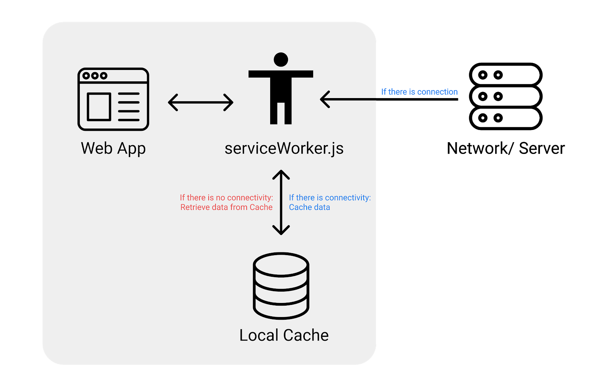

## What is a PWA

There are no clear definitions of PWA but simply put (as defined by us),  
PWAs are **websites** that provide a **native app experience** on a mobile phone, as well as any other devices.

> 'Progressive' can mean:
>
> 1. having a progressive enhancement strategy
> 2. “as the user progressively builds a relationship with the app over time, it becomes more and more powerful” according to Pete LePage – Google Developer Advocate

#### Some phrases/sentences used to describe a PWA by other online sources:

- built and enhanced with **modern APIs** to deliver enhanced **capabilities**, **reliability**, and **installability**
- while reaching anyone, anywhere, on any device with a **single codebase**
- designed so they are **capable**, **reliable**, and **installable**
- feels like a **platform-specific application**
- intended to **work on any platform** that uses a standards-compliant browser, including both desktop and mobile devices
- a type of application software delivered through the web, built using **common web technologies** including HTML, CSS and JavaScript
- provide a **better online experience** for mobile and **eliminate the need to download apps** from an app store
- the concept of creating a flexible, **adaptable app** using **only web technologies**
- web apps developed using a number of specific technologies and standard patterns to allow them to **take advantage of both web and native app features**

## Why PWA

Best of both worlds!  
A Website that behaves like a Native Application?

")

One of the most important points here is the \*reach\*\* we can get with web apps in general.

> If we require a user to download our application on the app store/play store, then we are drastically reducing our potential reach we can get for our app

- Nowadays, the browser is really powerful with many available [Web APIs](https://developer.mozilla.org/en-US/docs/Web/API) that the web app can utilise.
- What do we need in native applications that we cannot achieve in a PWA?

> In my opinion, Web Apps (or PWAs) should be the default standard for every project, unless we can rationalise why we need native applications to do the same job.

## Characteristics of a Native Mobile App

#### Reliable

Loads instantly and responsively

#### Fast

Responds quickly with a smooth application

#### Engaging

Good UIUX that resembles that of an app rather than a website

> If a PWA has these characteristics, does it mean it behaves like a native application?

## PWA Checklist

Google has created a PWA checklist for us ([core](https://web.dev/pwa-checklist/#core) & [optimal](https://web.dev/pwa-checklist/#optimal)) as a guideline to creating great PWA applications:  
Let me list down all of them here with a simple description.

#### 1. Starts Fast, Stays Fast

Fast loading of the websites and all components within. Some metrics will be measured by Lighthouse. Optimised for user-centric performance metrics. Increases User Retention.

#### 2. Works in Any Browser

The website should still work properly on all kinds of browsers, across a spectrum of devices and browsers, even with older browsers.

#### 3. Responsive to Any Screen Size

The layout of a website on a browser and mobile phone should be quite different. It should look more like an app when viewed on a mobile phone.

#### 4. Provides a Custom Offline Page

When there is no connection, it should not show the typical ‘No internet’ dinosaur page. It should show a cached custom offline page.

#### 5. Is Installable

Users are able to ‘install’ your PWA — afterwhich the PWA will have an App Icon on the home screen of their phones/computers, and seems like any other native app.

#### 6. Provides an Offline Experience

User should be able to navigate and interact with the application even without connection.

#### 7. Is Fully Accessible

Pass WCAG2.0 accessibility requirements - standards for creating accessible websites

#### 8. Can be discovered through search

Ability for the PWA website to be discovered organically through search engines e.g. Google. SEO discoverable.

#### 9. Provides context for permission requests

If you do have to use APIs (like push notifications, geolocation, credentials), it is important to ask for permission with additional context explaining the use of it.

## Technical components

### serviceWorker.js

This is an additional script in your web app that you can create to help you with certain tasks, especially when there are connectivity problems. (E.g. If there is no network, maybe we could return cached web pages
)

It is like a ‘Butler’ that helps you retrieve the information that you need - this is something you have to code to define its behaviour.



#### Some common use cases for serviceWorker.js

- cache certain pages once loaded, so it can load directly from cache next time
- display custom offline page when there is no connection

### manifest.json

This is a compulsory web app manifest file to be added at the root of your project - to specify basic metadata of your project

```json
// an example manifest.json by mozilla
{
  "name": "HackerWeb",
  "short_name": "HackerWeb",
  "start_url": ".",
  "display": "standalone",
  "background_color": "#fff",
  "description": "A readable Hacker News app.",
  "icons": [
    {
      "src": "images/touch/homescreen48.png",
      "sizes": "48x48",
      "type": "image/png"
    },
    {
      "src": "images/touch/homescreen72.png",
      "sizes": "72x72",
      "type": "image/png"
    },
    {
      "src": "images/touch/homescreen96.png",
      "sizes": "96x96",
      "type": "image/png"
    },
    {
      "src": "images/touch/homescreen144.png",
      "sizes": "144x144",
      "type": "image/png"
    },
    {
      "src": "images/touch/homescreen168.png",
      "sizes": "168x168",
      "type": "image/png"
    },
    {
      "src": "images/touch/homescreen192.png",
      "sizes": "192x192",
      "type": "image/png"
    }
  ],
  "related_applications": [
    {
      "platform": "play",
      "url": "https://play.google.com/store/apps/details?id=cheeaun.hackerweb"
    }
  ]
}
```

Possible fields in a manifest file:

(Basic ones are in bold)

- **background_color**
- categories
- **description**
- direction
- **display**
- iarc_rating_id
- **icons**
- lang
- **name**
- orientation
- prefer_related_applications
- related_applications
- scope
- screenshots
- **short_name**
- shortcuts
- **start_url**
- **theme_color**

From these fields, you can imagine why some fields are needed.

For instance, _theme_color_ dictates what color you want the PWA spash screen to be.

> Splash screens are the first 'loading' screen you see when you open all PWAs

---

> Actions speak louder than words, so try adding a simple **manifest.json** file to the root of your web project to easily upgrade your simple web app to a PWA that is installable directly from the browser! You will begin to realise the power of a PWA
