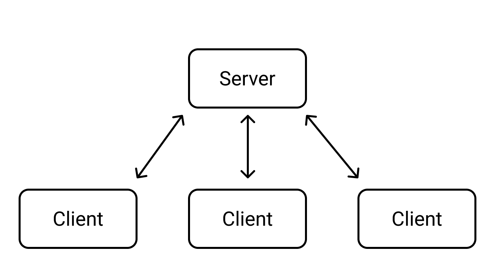
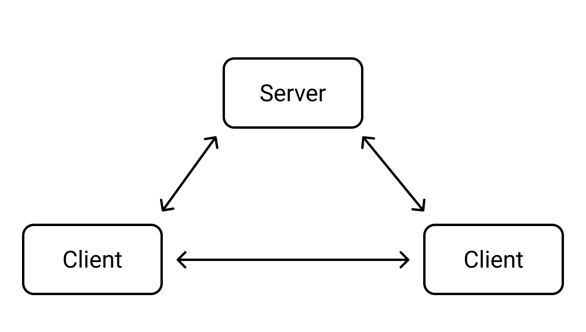

## What is WebRTC

Web Real Time Communications (WebRTC)

- Allows **Direct** connection between browsers
- Direct: Between the different client browsers, instead of going through the server

## WebSockets vs WebRTC

### WebSockets

- Open socket between server and client
  - To transfer any form of data
  - Via **TCP**

### WebRTC

- There is **Direct** connection amongst all unique server & client pairs

  - Note: Client browsers can directly talk to each other, instead of going through server
  - Via **UDP** - fast transfer data transfer

- Role of server here: To help coordinate the connections. E.g. How does Client A know that there is a Client B, and vice versa.

### Summarised Comparison

|               |                                                     WebSockets                                                      |                                                              WebRTC                                                               |
| ------------- | :-----------------------------------------------------------------------------------------------------------------: | :-------------------------------------------------------------------------------------------------------------------------------: |
| Definition    | WebSocket is a computer communications protocol, which provides communication channels over a single TCP connection | WebRTC is a open-soruce project that provides browsers and mobile apps with Real-Time communications capabilities via simple APIs |
| Latency       |                                                     Low Latency                                                     |                                                          Near Real-time                                                           |
| Data Transfer |                                                         TCP                                                         |                                                                UDP                                                                |
| Uses          |                                - Chat rooms, Location-based Apps, File Transfer, etc                                |                                         - Streaming, Video calls, Multiplayer games, etc                                          |

## Signalling

As mentioned, in WebRTC, signalling (How do the clients know about each other) is handled by the server

## Other components in WebRTC

- API
  - Simple APIs are available in WebRTC
- Indentify
  - Signalling
- Type of data
  - What kind of video is sent? e.g. Video, text, etc
- NAT Traversal
  - Technique to establish connection between clients, e.g. P2P, including metadata, etc
- Security
  - Some basic encryption is included in WebRTC
- Codec
  - Data compression

## Challenges in WebRTC

- WebRTC uses UDP
  - Not a reliable data transfer
- No standard signaling protocol
  - Different companies have their own ways of doing so
- Not fully compatible with all browsers
  - Chrome, firefox should be fine mostly
  - May have issues with Edge, Safari - Extra plugins required

## Why WebRTC

- Great for streaming services - real Time
- No need for extra apps
  - Think of GoogleMeets - Video call right from the browser, without having to install anything!
  - Can be done directly on the web browser
- Embedded in web technologies
  - Client servers, etc are done on the client browsers directly
- Secure
  - Runs inside browser, without creating new process
  - Less chance for spyware, malware, etc
  - If you need camera, rights must be granted (because it is using browser technologies)
