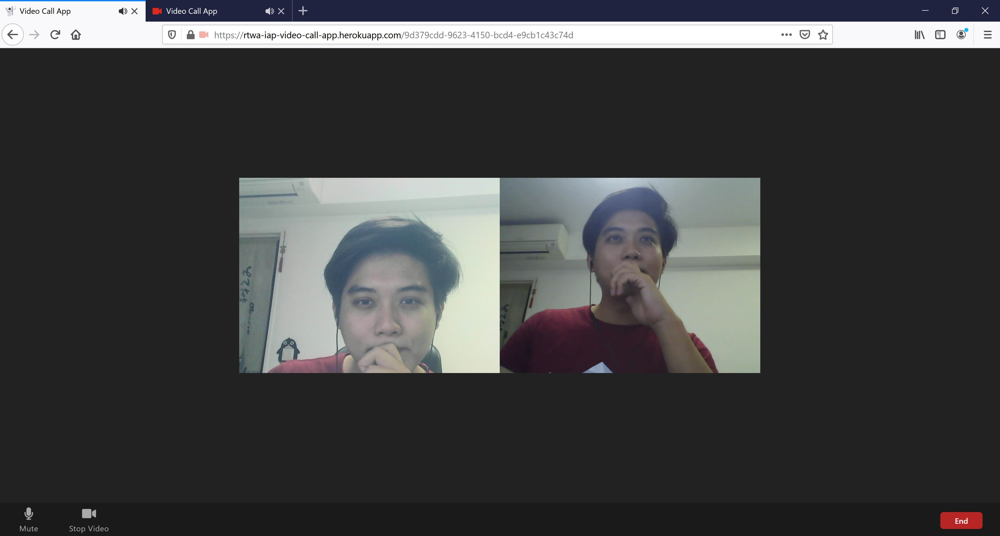

## Objectives

This is a similar to zoom group video conference call application.

> As seen in the screenshot above, we have 2 participants in this video call in browser tabs (using 2 different webcams). Using the live heroku hosted application link.

#### Behaviours

We want to build a group video call room with the following behaviour:
When someone starts the video call (by opening the url):

- user is assigned to a new room with a unique room id
- user waits listens and waits for any new connections to accept
- user may copy and send url (with room id) to another person, or try him/herself

When another user opens the url given (with an already created room):

- user joins the room
- server notifies the existing participants of the room that theres a new user
- user adds video feeds of the existing participants

When someone joins user's room:

- user accepts the new user and his connection
- user adds the new user's video and audio feed to his/her browser

When someone exits the room (or closes browser):

- user will broadcast to everyone in the room of exit
- existing participants will close the video and audio feed of this user who left

## Instructions

For reference:

The completed code can be found [here](https://github.com/realtime-apps-iap/video-call-app)

A live demo of the working app can be found [here](https://rtwa-iap-video-call-app.herokuapp.com)
