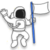

  

# Competition Info

We will be holding an Application Development Compeitition at the end of the workshop
to allow participants to make use of their real-time apps knowledge and create interesting application projects  
Everyone from all technical backgrounds are welcomed to participate!! 😊

> We are not looking for the "most technical" project. Everyone would have a fair chance to shine in your projects in your own ways!

## Aim of Competition 💡

For this competition, we want participants to create an application project that they can own as a worthy front-facing portfolio project for themselves.

You are free to **explore in any direction you are interested in**. As long as you meet the requirements below, there are no limitations on what you want to develop. You can do anything you want!  
Make this project shine! ✨

> This is a great chance for you to build a portfolio project :D

---

## Judging ⚖️

Our judging is intentionally left more open-ended because we want you to create a project that you like and is proud of.  
As long as you have met the requirements below, your project will be accepted.  
Take note of the scoring rubrics as this will be the guidelines for judges to score the projects fairly.

### Judging Panel 🧙

To be updated...

> We are in the midst of inviting guest judges, who may be professors, people from the industry, etc.

### Scoring 💯

Each judge will give up to **30 points** for each project.

#### 1. Creativity (10 points)

You have the **freedom to decide what is Creative and Innovative**.  
Creativity can be in terms of functionality, practical useful applications, aesthetic appeal, refreshing experience, etc.  
To aid in judging, please include in your documentation _what you think is creative about your project_.
The judges will have an open mind and score accordingly don't worry.

#### 2. Documentation (10 points)

In projects, it is important to have good documentation to help viewers understand your project easily - both from the standpoint of a developer wanting to try the project and a person simply glancing through your project.  
The minimum form of documentation we require is a **README.md** file at the root of your project.

Some considerations:

- Quality of documentation
- How well the project is explained & illustrated
- Shows how to set up the project well
- Instructions are clear
- Any technical considerations?
- etc.

#### 3. Workability (10 points)

Many a times, people will not set up and try your application. What they know of your project, is what they can easily see and interact with.  
As such, having a front-facing demo application that is simple to access and interact with is very important.  
Think from the perspective of you wanting to create this as a project that you want to include in your portfolio for others to view (your friends, recruiters, etc). It needs to have a good degree of workability for them to understand this project fully.

> Preferably, you have deployed your application and it can be accessed via a website link

Some considerations:

- Application deployed (e.g. heroku, netlify) and can be accessed easily
  - If the application you have created can't realistically be deployed easily, are there alternative ways to present your idea and what you have built?
- Application works smoothly & looks good.
- Users know how and what to do when they access the project.
- Users understand the project well at the end of interaction.
- etc.

### Requirements ☑️

Here are some basic requirements of the project:

- Project can be done solo or in teams of at most 2 people.
- Public repository on GitHub
- Started development no earlier than the first day of workshop
- There are realtime components to the application
  - E.g. WebSockets, WebRTC
  - You can use wrapper libraries like PeerJS

---

## Submission ✔️

Last day of submission will be the end of first week of the school term

**Date: 31st January 2021**

**Time: 2359**

Further instructions for submission will be updated on telegram group nearing to the submission date.

  All the project submissions will be posted on a dedicated projects page on our
  website :)

 

---

## Prizes 🏆

Stand to win prizes of up to $100.

> Actual prizes will be updated soon

There will be 2 winners with the top 2 scored projects.

**1️⃣ Champion**  
**2️⃣ Runner-Up**

In addition we have a most popular project awarded to the project with the _most stars_ on their repository.  
**3️⃣ Most Popular Project**

> Most Popular Project can be won by any team regardless of their scoring.

---

 Any questions, feel free to contact us directly on telegram 😊
